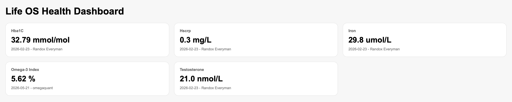
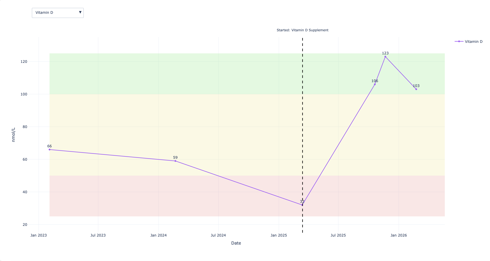
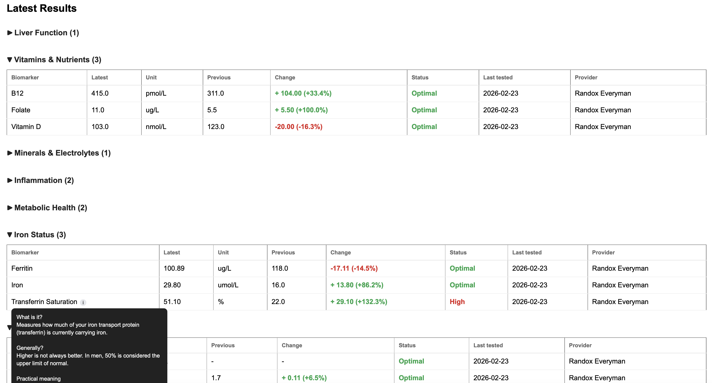

# Life OS Health Dashboard

## Why I built this

As I've moved into my early 20s, I've started taking my health more seriously, which has naturally led to getting more blood tests.

The problem is those results end up scattered across different providers and reports, making it difficult to see how biomarkers are changing over time or quickly give doctors useful historical context.

I built this project to bring those results into one place, standardise them, and make long-term health trends easier to understand.

The result is a small personal health analytics pipeline that:

- stores blood test history from multiple providers
- converts raw results into a consistent longitudinal format
- visualises biomarker trends over time
- compares latest results with previous tests
- shows configurable reference and optimal ranges
- tracks interventions alongside biomarker changes
- organises biomarkers into categories with contextual explanations

## Architecture

```text
Blood test results
        ↓
Stage 0 - Raw data
        ↓
Python canonicalisation
        ↓
Stage 1 - Canonical dataset
        ↓
Python dashboard generation
        ↓
Stage 2 - Interactive HTML dashboard
```

Raw blood test results are entered in a simple wide-format CSV.

`build_canonical.py` converts those results into a longitudinal schema where each row represents an individual biomarker result.

`build_dashboard.py` then combines the canonical dataset with biomarker configuration and intervention data to generate the interactive dashboard.

Biomarker metadata such as units, ranges, KPI visibility, categories and descriptions is stored separately in `biomarker_ranges.csv`, keeping dashboard behaviour configuration-driven rather than hardcoded.

## Dashboard

The dashboard combines current state with historical context.

It includes:

- KPI cards for selected biomarkers
- interactive biomarker trend charts
- reference and optimal range overlays
- provider-aware result history
- latest vs previous result comparisons
- absolute and percentage change detection
- Low / Normal / Optimal / High status classification
- intervention timeline markers
- category-based collapsible result sections
- biomarker explanation tooltips

A synthetic sample dataset is included in the repository so the project can be explored without exposing personal health information.

### Dashboard overview



### Biomarker trends



### Latest results



## How to Run

1. Clone the repository

```bash
git clone <repo-url>
cd health-project
```

2. Create a virtual environment

```bash
python3 -m venv venv
```

3. Activate it

macOS / Linux:

```bash
source venv/bin/activate
```

Windows:

```bash
venv\Scripts\activate
```

4. Install dependencies

```bash
pip install -r requirements.txt
```

5. Build the canonical dataset

```bash
python Scripts/build_canonical.py
```

6. Build the dashboard

```bash
python Scripts/build_dashboard.py
```

The generated dashboard will open automatically in your default browser.

## Project evolution

The project was built incrementally:

1. **Initial prototype** – started with a small Excel blood tracker and Python visualisation.
2. **Canonical pipeline** – separated raw data, transformed data and dashboard generation into distinct stages.
3. **Historical expansion** – expanded the dataset across multiple years, providers and a broader biomarker inventory.
4. **Context and change detection** – added intervention tracking, latest-vs-previous comparisons and status classification.
5. **Knowledge and organisation layer** – added biomarker categories, collapsible sections and contextual descriptions.

Detailed iteration logs are available in the `Milestones/` directory.

## Technologies

- Python
- pandas
- Plotly
- HTML / CSS
- CSV-based configuration

## What I learned

What started as a simple way of keeping blood test results in one place became an exercise in designing a small longitudinal data system.

This project gave me practical experience with:

- staged data pipeline design
- converting wide-form source data into a canonical longitudinal schema
- separating raw, transformed and presentation layers
- configuration-driven application behaviour
- working with multi-provider historical datasets
- building interactive Plotly visualisations
- change detection and status classification
- modelling interventions separately from biomarker observations
- handling personal-data privacy when preparing a project for public use

The biggest lesson was that the value of health data often comes from context over time rather than any individual measurement.